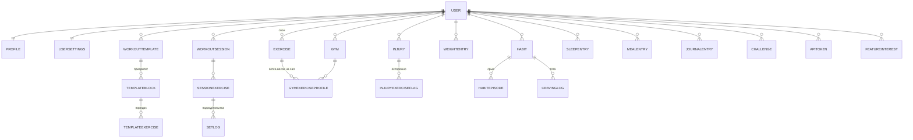

# 02. Схема данных

Условные обозначения в таблицах полей:
`PK` первичный ключ · `FK` внешний ключ · `U` уникальное · `?` допускает NULL · `Δ` вычисляемое и кэшируемое · `S` синхронизируемое оффлайн (`client_id`, `updated_at`, `deleted_at`)

Базовые миксины:
- **OwnedModel** → `user FK CASCADE` + индекс `(user, created_at)`. Наследуют все пользовательские таблицы.
- **SyncableModel** → `client_id UUID U(user,client_id)`, `client_updated_at`, `updated_at`, `deleted_at?`.

Единицы хранения — **всегда метрические и всегда одни и те же**: кг, см, мл, граммы, **секунды целым числом**, метры. Имперские единицы — исключительно слой отображения. Это защита от бага №3: в БД физически нет неоднозначного формата.

---

## 2.1 Карта доменов



---

## 2.2 accounts — аккаунты и доступ

### User (кастомная модель)
| Поле | Тип | Прим. |
|---|---|---|
| id | UUID | PK |
| username | citext-like varchar(32) | **U (регистронезависимо)** через `UniqueConstraint(Lower('username'))`; валидатор `^[A-Za-z0-9_]{5,32}$`; список зарезервированных (`admin`, `api`, `me`, `support`…) |
| email | email | U, ? |
| phone | varchar(20) E.164 | U, ? |
| display_name | varchar(80) | меняется свободно |
| password | hash | |
| apple_sub | varchar | U, ? — Sign in with Apple |
| is_active, date_joined, last_login | | |

**Constraint БД:** `CHECK (email IS NOT NULL OR phone IS NOT NULL)`.
`@username` — только представление, в БД без собачки.

### Profile (1:1 с User)
`sex` (male/female/other/unspecified) · `birth_date?` · `height_cm?` · `start_weight_kg?` · `timezone` (default `Europe/Moscow`) · `unit_system` (metric/imperial) · `language` (ru/en) · `avatar?` (ImageField) · `avatar_seed` (строка для детерминированной заглушки из инициалов) · `goal_weight_kg?` · `goal_bodyfat_pct?` · `goal_deadline?`

Аватар-заглушка **не хранится как файл**: генерируется на клиенте из инициалов `display_name` + `avatar_seed` (детерминированный индекс в нейтральной палитре токенов).

### UserSettings (1:1 с User)
| Группа | Поля |
|---|---|
| Экран «Сегодня» | `today_blocks` JSON — массив `{block_id, visible, order}` (реестр блоков в §3.3) |
| Питание | `protein_target_g` · `track_calories` **default False** · `calorie_target?` · `water_target_ml` (2000) · `water_glass_ml` (250) · `free_meal_weekday?` |
| Сон | `bedtime_goal` TIME · `wake_goal` TIME · `sleep_target_minutes` (480) · `commute_home_minutes` · `wind_down_minutes` (60) |
| Тренировки | `default_gym FK?` · `rest_default_seconds` (90) · `rest_presets` JSON · `ask_rir` bool · `warmup_prompt` bool |
| Дневник | `diary_lock_enabled` · `diary_pin_hash?` · `diary_biometric` bool |
| Прочее | `week_starts_on` (1=пн) · `theme` (auto/light/dark) |

### NotificationSettings (1:1)
`max_per_day` (default **2**) · `morning_weigh_in_enabled` + `time` · `bedtime_reminder_enabled` + `minutes_before` (30) · `habit_risk_reminder_enabled` (время вычисляется из `CravingLog`, §2.9) · `quiet_hours_from/to` · `push_enabled`

### PushSubscription
`user FK` · `endpoint U` · `p256dh` · `auth` · `user_agent` · `created_at` · `last_success_at?` · `failure_count`

### ApiToken
`user FK` · `name` · `token_hash` (sha256, **сам токен не хранится**) · `prefix` (8 симв. для отображения) · `scope` (`read` / `write`) · `created_at` · `last_used_at?` · `expires_at?` · `revoked_at?`

### ShareLink — публичная ссылка только на чтение
`user FK` · `slug U` (22 симв. урлбезопасный рандом) · `kind` (`weekly_report` / `workout` / `context`) · `object_id?` · `period_from?` · `period_to?` · `expires_at?` · `revoked_at?` · `view_count` · `password_hash?`
Отдаётся анонимно по `/s/<slug>`, при `revoked_at` → 410 Gone.

### FeatureInterest — вкладка «Друзья» (раздел 11)
| Поле | Тип |
|---|---|
| id | PK |
| user_id | FK |
| feature | varchar (`friends`, `friends_challenges`, `suggestion`, …) |
| timestamp | datetime (auto) |
| message | text ? — для поля «предложить, что ещё добавить» |

`unique(user, feature)` для кнопок-подписок, свободные предложения (`feature='suggestion'`) — без ограничения.

---

## 2.3 catalog — справочники (глобальные, read-only для пользователя)

- **Muscle**: `code U` · `name_ru` · `name_en` · `group` (chest/back/shoulders/biceps/triceps/quads/hamstrings/glutes/calves/core/forearms/neck)
- **Equipment**: `code U` · `name_ru` · `name_en` (barbell, dumbbell, machine, cable, bodyweight, kettlebell, band, other)
- **BodyPart**: `code U` · `name_ru/en` · `region` · `svg_path_id` — для карты тела при вводе травмы (раздел 5)
- **MovementTag**: `code U` (overhead, spinal_load, knee_dominant, hip_hinge, horizontal_push, vertical_push, horizontal_pull, vertical_pull, rotation, impact) — связующее звено «травма ↔ упражнения»
- **FailReason**: `code U` · `name_ru/en` · **`counts_against_discipline` bool** — значения по умолчанию: `machine_busy=False`, `pain=False`, `no_time=False`, `illness=False`, `no_energy=True`, `forgot=True`, `other=True`. Пользователь может переопределить в настройках.
- **HealthTimelineItem**: `habit_kind` · `hours_after` · `title_ru/en` · `description` — таймлайн улучшений при отказе (раздел 9)
- **BodyPartMovementRisk**: `body_part FK` · `movement_tag FK` · `level` (caution/avoid) — именно отсюда берётся «травма плеча → всё над головой помечено «осторожно»»

---

## 2.4 training — тренировки

### Exercise
| Поле | Тип | Прим. |
|---|---|---|
| owner | FK User ? | NULL = глобальное из сидов |
| name | varchar(120) | |
| aliases | JSON[] | для поиска |
| **load_type** | enum | `weight_reps` / `time` / `bodyweight_reps` / `distance` |
| equipment | FK Equipment ? | |
| **is_unilateral** | bool | **вес указан на одну сторону** → тоннаж ×2 |
| bodyweight_factor | decimal ? | доля веса тела для подтягиваний/отжиманий (0.65 и т.п.), по умолчанию не считается в тоннаж |
| default_rest_seconds | int | пресет таймера отдыха |
| movement_tags | M2M MovementTag | для связи с травмами |
| instructions, video_url | text ? | |
| is_archived | bool | |

- **ExerciseMuscle**: `exercise FK` · `muscle FK` · `role` (primary/secondary) — база для анализа объёма по группам и дисбаланса
- **ExerciseAlternative**: `exercise FK` · `alternative FK` · `owner FK?` (NULL = глобальная рекомендация) · `order` · `note` — список «тренажёр занят» (раздел 4.1)

### Gym
`user FK` · `name` · `kind` (home/work/travel/other) · `is_default` · `notes?`

### GymExerciseProfile — ★ ключевая таблица
Один и тот же тренажёр в разных залах — разные цифры. `unique(user, gym, exercise)`.

| Поле | Тип | Прим. |
|---|---|---|
| **weight_steps** | JSON[] decimal ? | Фактическая сетка: `[36.2, 40.8, 45.3, 49.8, 54.4, 58.9]`. Кнопки +/− ходят **по индексу в этом массиве** |
| step_kg | decimal ? | Фолбэк, если сетка линейная (2.5 / 1.25) |
| last_weight_kg | decimal ? Δ | для предзаполнения |
| last_reps | int ? Δ | |
| machine_number | varchar ? | «тренажёр №4» |
| seat_settings | varchar ? | «сиденье 3, спинка 5» |
| grip | varchar ? | |
| notes | text ? | |
| photo | Image ? | фото настроек |

### WorkoutTemplate / TemplateBlock / TemplateExercise
- **WorkoutTemplate**: `user` · `name` · `description?` · `estimated_minutes Δ` · `duration_limit_minutes?` · `is_active`
- **TemplateBlock**: `template FK` · `name` · **`priority`** (`required` обязательный / `main` основной / `optional` по остатку сил) · `order`
- **TemplateExercise**: `block FK` · `exercise FK` · **`order`** (drag&drop) · `target_sets` · `target_reps_min/max?` · `target_seconds?` · `target_weight_kg?` · `rest_seconds?` · `notes?`
- **TemplateSchedule**: `template FK` · `weekday` 0–6 · `is_auto_repeating` · `start_date?`
- **PlannedExclusion** — «сегодня НЕ делаем» (раздел 4.2): `user` · `exercise FK` · `template FK?` · `date_from` · `date_to?` · `reason` text · `created_at`. Отображается как **решение**, а не пропуск.

**Оценка длительности:** `Σ(target_sets × (время подхода ≈ 45с + rest_seconds)) + разминка`. Сравнивается с `duration_limit_minutes`, показывается прямо в редакторе шаблона.

### WorkoutSession `S`
`user` · `gym FK?` · `template FK?` · `date` · `started_at?` · `ended_at?` · `duration_seconds? int` · `status` (planned/in_progress/completed/abandoned) · `wellbeing_1_10?` · `notes?` · **`is_training_while_injured`** · `tonnage_kg Δ` · `working_sets_count Δ`

Обрати внимание: **статуса «провалено» нет**. День с выполненным `required`-блоком возвращает `completion.required_done = true` независимо от остального.

### SessionExercise `S`
`session FK` · `exercise FK` · `template_exercise FK?` · `block_priority` (снапшот) · `order` · **`status`** (`pending` / `done` / `skipped` / `failed`) · `fail_reason FK?` · `fail_reason_note?` · `substituted_for FK?` (когда взял альтернативу) · `notes?`

Три состояния, как в задании: `done` / `skipped` (осознанно пропустил) / `failed` («не смог» + причина). В дисциплину не идут `skipped` и те `failed`, чья причина имеет `counts_against_discipline=False`.

### SetLog `S` — подход и он же попытка статики
| Поле | Тип | Прим. |
|---|---|---|
| session_exercise | FK | |
| set_number | int | порядковый в рамках упражнения |
| **is_warmup** | bool | **разминочные не идут в рабочий тоннаж** |
| weight_kg | decimal(6,2) ? | |
| **weight_is_per_side** | bool | снапшот `is_unilateral` на момент записи — чтобы пересчёт задним числом не сломал историю |
| reps | int ? | |
| **duration_seconds** | **int ?** | **только целые секунды. Никаких TimeField** |
| distance_m | int ? | |
| rir | int ? 0–5 | |
| completed_at | datetime | |
| notes | text ? | |

**Формула тоннажа:**
```
tonnage = Σ по НЕразминочным подходам:
    weight_kg × reps × (2 если weight_is_per_side иначе 1)
time / distance / bodyweight_reps → в тоннаж не входят (считаются отдельными метриками)
```

### PersonalRecord
`user` · `exercise` · `kind` (`max_weight` / `max_reps` / `max_duration_seconds` / `est_1rm` / `max_set_volume`) · `value` · `achieved_on` · `set_log FK?` · `gym FK?`
Пересчитывается при записи подхода. `est_1rm` — Epley, помечается как оценочный.

### ProgressionSuggestion
`user` · `exercise` · `gym` · `kind` (`increase` / `stall` / `deload` / `spike_warning` / `imbalance`) · `suggested_weight_kg?` · `payload JSON` · `created_on` · `dismissed_at?` · `applied_at?`

Правила (раздел 4.5), все пороги — константы в настройках, не магические числа в коде:
| Правило | Условие |
|---|---|
| Прибавка | все рабочие подходы в верхней границе повторов **и** RIR ≥ 2 → следующий шаг **из `weight_steps` этого зала** |
| Резкий скачок | рабочий вес или est1RM вырос **> 10% за 7 дней** → предупреждение с пояснением «связки адаптируются медленнее мышц» |
| Застой | 3 недели без роста рабочего веса / est1RM → предложить смену схемы |
| Разгрузка | 6–8 недель без недели с ≤1 тренировкой → предложить деload |
| Дисбаланс | недельные рабочие подходы: `push / pull > 2.0` или обратное → предупреждение |
| Порядок | упражнение `skipped`/`failed` N раз подряд → «пропущено N раз подряд, попробуй поставить раньше» + кнопка «переместить в начало» |

---

## 2.5 safety — травмы и ограничения

### Injury
`user` · `body_part FK` · `side` (left/right/both/na) · `character` (sharp/dull/ache/numbness/stiffness/other) · `started_on` · `resolved_on?` · `initial_severity` 1–10 · `notes?` · `is_active Δ`

### InjuryLog — динамика по дням
`injury FK` · `date` · `severity_1_10` · `note?` · `unique(injury, date)`

### InjuryExerciseFlag
`injury FK` · `exercise FK` · `level` (caution/avoid) · `is_auto` · `dismissed_at?`
Создаётся автоматически: `Injury.body_part` → `BodyPartMovementRisk` → `MovementTag` → все упражнения с этим тегом. Пользователь может снять флаг вручную.

### WeightLimit — персональные лимиты (раздел 5)
`user` · `exercise FK?` · `movement_tag FK?` · `max_weight_kg` · **`reason` text** («скручивания не выше 63 кг — спина») · `created_on` · `is_active`
При вводе большего веса — **не блокировка**, а напоминание с показом причины. Событие пишется в `WeightLimitOverride` (`user`, `set_log`, `limit`, `entered_weight`, `at`) — чтобы потом увидеть, как часто лимит игнорируется.

### ReturnTest — тест возврата
`injury FK` · `exercise FK` · `date` · `pain_without_weight` bool · `answer_note?` · `unlocked` bool
Пока `unlocked=False`, упражнение показывается с меткой и требует прохождения теста.

### RecurrenceNotice — повторные эпизоды
`user` · `body_part FK` · `first_injury FK` · `second_injury FK` · `days_between` · `created_at` · `acknowledged_at?`
Триггер: вторая травма той же зоны **в пределах 60 дней** → заметное (не мигающее) сообщение с рекомендацией обратиться к врачу. Не скрывается автоматически.

---

## 2.6 recovery — сон и восстановление

### SleepEntry `S`
`user` · **`night_of` date** (ночь «с 17-го на 18-е» хранится как 17-е) · `bed_time datetime?` · `wake_time datetime?` · **`duration_minutes int Δ`** · `quality_1_5?` · `awakenings?` · `source` (manual/shortcut/healthkit/native) · `external_id?` · `note?` · `unique(user, night_of, source)`

Ввод — **отбой и подъём как время** (`type="time"`), а не галочка. `duration_minutes` считается на сервере, переход через полночь обрабатывается явно.

### HealthMetric
`user` · `date` · `kind` (`steps` / `resting_hr` / `hr_avg` / `active_energy_kcal` / `workout_minutes` / `distance_m` / `hrv_ms`) · `value` · `source` · `external_id?` · `unique(user, date, kind, source, external_id)` — дедупликация повторных импортов.

### IllnessPeriod
`user` · `date_from` · `date_to?` · `label?` · `note?`
Дни внутри периода **исключаются из статистики дисциплины** и помечаются на всех графиках.

### Вычисляемое (без своих таблиц)
- **Долг сна за неделю** = `Σ(target − fact)` по 7 ночам, только положительные отклонения.
- **Попадания в целевой отбой** = доля ночей, где `bed_time ≤ bedtime_goal + 15 мин`.
- **Предупреждение** при 3 подряд ночах < 6 ч — формулировка про риск заболеть, без упрёка.
- **«Во сколько выйти из зала»** = `bedtime_goal − commute_home_minutes − wind_down_minutes`; на экране тренировки показывается живым таймером «выйти до 21:10».
- **График «сон → самочувствие в зале»**: `SleepEntry.duration_minutes` (ночь перед тренировкой) против `WorkoutSession.wellbeing_1_10` на одних осях.

---

## 2.7 nutrition — питание

- **FoodItem**: `owner FK?` (NULL = сид) · `name` · `serving_label` («порция», «стакан», «100 г») · `serving_grams?` · **`protein_g`** · `calories?` · `fat_g?` · `carbs_g?` · `sugar_g?` · `barcode?` · `is_quick_button` · `use_count Δ` · `last_used_at Δ`
  Быстрые кнопки формируются автоматически: топ по `use_count` + закреплённые вручную. Добавление в свою базу — одним тапом из истории.
- **MealTemplate** (`user`, `name`, `default_meal_type`) + **MealTemplateItem** (`template`, `food_item`, `quantity`) — «мой обычный завтрак» в один тап.
- **MealEntry** `S`: `user` · `at datetime` · `meal_type` (breakfast/lunch/dinner/snack) · `protein_g Δ` · `calories? Δ` · `note?` · `photo?` · `source` (quick/template/barcode/manual/photo_only)
  **Фото без обязательного анализа** — `photo_only` создаёт запись без единого числа.
- **MealEntryItem**: `meal_entry` · `food_item?` · `custom_name?` · `quantity` · `protein_g` (снапшот)
- **WaterLog** `S`: `user` · `at` · `volume_ml` (+1 стакан = один тап)
- **Supplement** (`user`, `name`, `default_time?`, `is_active`, `order`) + **SupplementLog** `S` (`supplement`, `date`, `taken`, `unique(supplement,date)`) → серия дней считается по этой таблице
- **DietExceptionLog** `S` — ★ раздел 7: `user` · `at` · **`kind`** (`sweets` / `fastfood` / `alcohol` / **`sugary_drink`** / `other`) · `amount_note?` · `estimated_sugar_g?` · `note?`
  **`sugary_drink` — отдельный вид, не «еда».** Недельный итог показывает его отдельной строкой: «сладкие напитки: 5 × ≈25 г сахара».
- **FreeMeal**: `user` · `planned_for date` · `happened_on date?` · `note?` · `within_limit bool?` — плановое послабление раз в неделю.

**Калории:** `UserSettings.track_calories` по умолчанию **False**. Пока выключено — в UI нет ни одного поля калорий, только белок. Если включено — расход считается **адаптивно** по факту:
```
TDEE ≈ средн. потребление за 14 дней − (Δ тренд-веса за 14 дней × 7700 ккал/кг) / 14
```
Формулы Харриса–Бенедикта используются только как стартовое приближение при отсутствии данных и явно помечаются как оценка.

---

## 2.8 body — замеры тела

### WeightEntry `S`
`user` · `at datetime` · `weight_kg decimal(5,2)` · **`conditions` JSON** (`{morning, fasted, after_toilet, undressed}`) · `source` (manual/scale/healthkit) · `note?`

### WeightTrendPoint Δ
`user` · `date U(user,date)` · `raw_kg?` · **`trend_kg`** · `points_used`
Пересчитывается при каждой записи веса. **Основная отображаемая цифра — `trend_kg`** (скользящее среднее за 7 дней), сырой вес — мелким шрифтом рядом.
Сравнение замеров с разными `conditions` → пометка «замеры несравнимы: утро натощак vs вечер».

### BodyMeasurement
`user` · `date` · `site` (**waist** / chest / hips / arm_l / arm_r / thigh_l / thigh_r / neck / calf) · `value_cm` · `note?` · `unique(user, date, site)`
Талия выделена в UI как главный обхват — часто показывает прогресс раньше весов.

### BodyCompositionScan (InBody и аналоги)
`user` · `at` · `device` · `weight_kg` · `body_fat_pct` · `body_fat_kg` · `skeletal_muscle_kg` · `total_water_l` · `intracellular_water_l` · `extracellular_water_l` · `protein_kg` · `minerals_kg` · `visceral_fat_level` · `bmr_kcal` · `score` · `photo?` (фото листка) · `conditions_note?`

### BodyCompositionSegment
`scan FK` · `segment` (arm_l / arm_r / trunk / leg_l / leg_r) · `lean_mass_kg` · `fat_mass_kg` · `lean_pct_of_norm?`

Подсказки при вводе (текстом рядом с полями, раздел 8): прирост «мышечной массы» частично объясняется водой и гликогеном; замер делать в одинаковых условиях — одно время дня, до тренировки.

### ProgressPhoto
`user` · `date` · `pose` (front/side/back) · `photo` · `outline_used bool` · `note?` · `is_private bool`
**PhotoSchedule**: `user` · `interval_days` · `next_due_on`

### Вычисляемое
- Сколько жира до целевого % и прогноз даты при текущем темпе (линейная регрессия по тренд-весу + последним замерам состава).
- Предупреждение о слишком быстром снижении: **> 1% массы тела в неделю** по тренду → «риск потерять мышцы», нейтральной формулировкой.

---

## 2.9 habits — привычки

### Habit
`user` · `name` · **`kind`** (`quit` отказ / `build` полезная) · **`decision_date`** (дата решения — **никогда не сбрасывается**) · `unit` (days/count) · `target_per_week?` · `money_per_day?` · `icon_token?` · `order` · `is_active`

### HabitEpisode — срыв, который НЕ стирает историю
`habit FK` · **`occurred_at`** (можно задним числом) · `amount?` · `trigger` (enum как в `CravingLog`) · `note?` («что случилось») · `created_at`

Из этих двух таблиц считаются **обе цифры, и первая никогда не обнуляется**:
```
days_since_decision = today − decision_date              ← НИКОГДА не сбрасывается
current_streak      = today − (последний episode.occurred_at)
total_clean_days    = days_since_decision − число дней с эпизодами
```
На таймлайне срыв — точка, серия начинается рядом. Задним числом добавленный эпизод пересчитывает серии честно (все три числа — производные, не хранимые счётчики, поэтому пересчёт корректен по определению).

### HabitCheckin `S` — для полезных привычек
`habit FK` · `date` · `done` · `value?` · `note?` · `unique(habit, date)`

### CravingLog `S` — журнал тяги
`user` · `habit FK` · `occurred_at` · `intensity_1_10` · `trigger` (stress / boredom / alcohol / social / after_meal / commute / evening / other) · `place?` · `what_helped?` · `resisted bool`
Автовыявление закономерностей: гистограммы по часу суток / дню недели / триггеру → «риск выше всего в будни 21:00–23:00». Отсюда же берётся время персонального напоминания (раздел 15).

### Replacement — личные заменители
`user` · `habit FK?` · `text` · `order` — быстрый доступ в момент тяги и на экране SOS.

### SosSession
`user` · `habit FK?` · `started_at` · `ended_at?` · `outcome` (passed/gave_in/unknown) · `note?`
Таймер 5 минут + текст «тяга проходит сама» + список заменителей.

### Challenge / ChallengeEntry
- **Challenge**: `user` · `title` («29 прогулок по 4 км за лето») · `target_value` · `unit` (count/km/minutes/sessions) · `started_on` · `deadline` · **`auto_rule` JSON** (`{source:"health", metric:"distance_m", min_value:4000, single_activity:true}`) · `is_active`
- **ChallengeEntry**: `challenge FK` · `date` · `value` · `source` (manual/health) · `external_id?` · `note?`
Автозачёт: при импорте из Health каждая активность проверяется против `auto_rule`; засчитывается только то, что проходит критерий (дистанция ≥ 4 км за одну активность).

**Экономия денег** = `money_per_day × total_clean_days`.
**Таймлайн здоровья** = `HealthTimelineItem` отфильтрованный по `current_streak`.

---

## 2.10 journal — дневник

- **JournalEntry** `S`: `user` · `date` · `at` · `text?` · `photo?` · `is_locked` · теги M2M
- **Tag**: `user` · `name` · `unique(user, lower(name))`
- **QuickAnswer**: `entry FK` · `question` (`went_well` / `was_hard` / `proud_of`) · `text`
- **VoiceNote**: `entry FK` · `audio` · `duration_seconds int` · `transcript?` · `status` (pending/done/failed)
- **LifeEvent** — ★ метки значимых событий: `user` · `date_from` · `date_to?` · `kind` (injury/trip/illness/exam/move/other) · `title` · `note?` · `show_on_charts` (default True)
  Рендерятся **вертикальными линиями на всех графиках** — объяснение провалов вместо самобичевания.
- **DailyLog** `S` — настроение и энергия с «Сегодня»: `user` · `date U(user,date)` · `mood_1_5?` · `energy_1_5?` · `note?`

Пин-код/биометрия на раздел: `UserSettings.diary_pin_hash`. Замок — **клиентский гейт + серверная проверка**: записи дневника не отдаются в общий `/api/context/`, пока не передан флаг `include_journal=true` с подтверждением.

---

## 2.11 analytics / reports

- **Insight**: `user` · `period_from` · `period_to` · `kind` (`correlation` / `weak_link` / `what_worked` / `forecast`) · `payload JSON` · `created_at`
  Корреляции (Спирмен, с указанием n и оговоркой «связь ≠ причина»): сон ↔ самочувствие, сон ↔ вес, сладкое ↔ вес, тренировки ↔ настроение.
  **«Слабое звено недели»** — ровно **одна** метрика с наибольшим негативным вкладом. Не список.
- **Standard** (нормативы): `user` · `name` · `source` (`exercise_max_duration` / `exercise_max_reps` / `exercise_max_weight` / `manual`) · `exercise FK?` · `target_value` · `unit` · `deadline?` · `current_value Δ`
- **WeeklyReport**: `user` · `week_start` · `variant` (`coach` подробная / `self` короткая) · `blocks_config JSON` · `stats JSON` (снапшот всех чисел) · `headline_metric` · `verdict` · `weak_link` · `focus_next_week` · `pdf FileField?` · `share_link FK?` · `generated_at`

`stats JSON` — снапшот: отчёт за прошлую неделю не должен меняться, если сегодня поправить старую запись.

---

## 2.12 sync / integrations

- **SyncOperation**: `user` · `op_id UUID U` · `entity` · `client_id` · `applied_at` · `result` — гарантия идемпотентности при обрыве связи.
- **HealthImport**: `user` · `source` (shortcut/xml/native) · `received_at` · `records_created` · `records_skipped` · `status` · `error?`
- **PlanImport** (приём рекомендаций от ИИ): `user` · `raw_text` · `format` (markdown/json) · `parsed JSON?` · `created_template FK?` · `status` · `errors JSON?`

---

## 2.13 Что считается «выполненным днём» (сводка правил)

Это самое важное определение во всём приложении — от него зависит, бросит человек трекер или нет.

```
День тренировки выполнен  ⟺  все упражнения блока priority=required имеют status=done
                              (main и optional не влияют на «выполнено»)

Дисциплина (%)            =  done / (done + failed_with_counting_reason)
                              skipped — не учитывается
                              failed с counts_against_discipline=False — не учитывается
                              дни IllnessPeriod — полностью исключены

Прогресс дня («Сегодня»)  =  отмечено блоков / включённых блоков
                              пустое состояние показывается нейтрально, без «ты пропустил»
```
